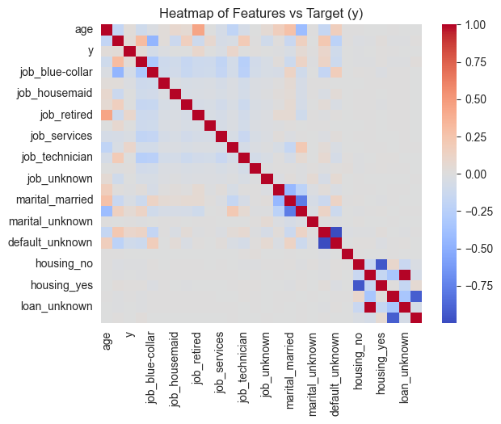
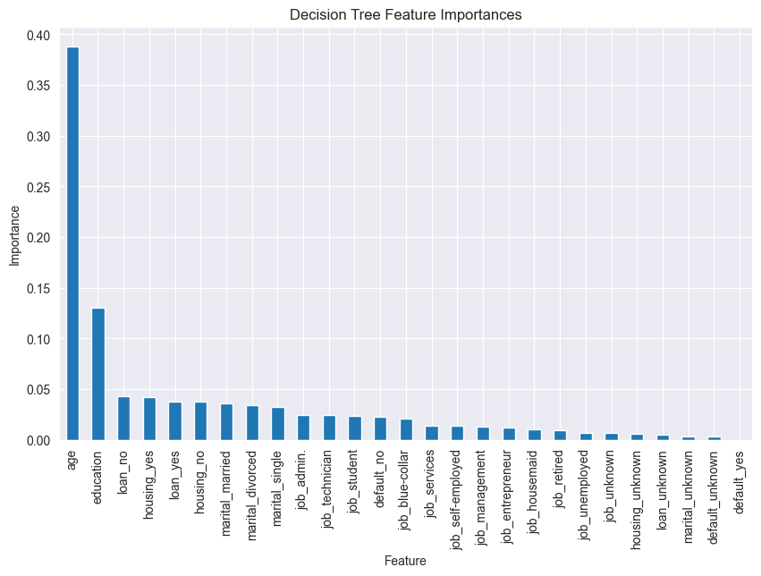

# Analysis of Findings
During our analysis of the banking data, we utilized several different models to understand the relationship between 
various features in the dataset, and their impact on our desired target.

## Factors That Influence the Target
Initially, we checked to see if there was an obvious relationship between any given feature and the target. As visualized 
by this heatmap, there was no clear standout -- meaning the relationship between any given feature and the target is not linear.

Utilizing a DecisionTree model, we can see which feature was most important in influencing the target: age.

Upon further analysis, we see that those who are 60.5 years old or older, and are self-employed are unlikely to subscribe 
to a term deposit. Those who are younger than 60.5 years old, and have not defaulted on a loan, have a more complex relationship 
whether they will subscribe. Likewise, those who are older than 60.5 years old and are not self-employed have a complex relationship 
whether they will subscribe. 

## Recommendations
We recommend that those who are 60.5 years or older and self-employed be exempted from marketing attempts to sign up for a term deposit.
